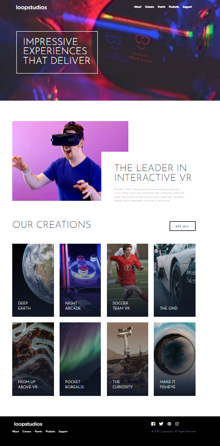

# Project Documentation: Loopstudious Front-end Challenge

## Table of Contents

1. [Introduction](#introduction)
2. [Live Demo](#live-demo)
3. [Screenshot](#screenshot)
4. [Project Description](#project-description)
5. [Technologies Used](#technologies-used)
6. [Challenges Faced](#challenges-faced)
7. [Key Features](#key-features)
8. [Installation](#installation)
9. [Usage](#usage)
10. [Contributions](#contributions)
11. [Credits](#credits)
12. [License](#license)

---

### 1. Introduction 

This document provides documentation for the Loopstudious Front-end Challenge, which was completed as part of a mentorship program. The project includes a live demo, a screenshot, project description, technologies used, challenges faced, key features, installation instructions, usage guidelines, and credits.

### 2. Live Demo 

You can access the live demo of the project by following this [link](https://hamzeh01.github.io/Loopstudios/).

### 3. Screenshot 

### 4. Project Description 

The Loopstudious Front-end Challenge involves creating a front-end web page for Loopstudios, a fictional company. The web page includes a hero section, feature section, creation section, and other inner pages.

### 5. Technologies Used 

- HTML5
- CSS3
- JavaScript

### 6. Challenges Faced 

- hamburger menu functionality

### 7. Key Features 

Highlight the key features of your project. This could include responsive design, interactivity, or any special functionality.

### 8. Installation 

Provide instructions on how to install and run the project locally. Include any dependencies or prerequisites.

### 9. Usage 

Explain how to use the project once it's installed. Provide any relevant commands or information.

### 10. Contributions 

If this project is open for contributions, describe how others can contribute.

### 11. Credits 

Give credit to any resources, libraries, or individuals who contributed to the project's development.

### 12. License 

Specify the project's license if applicable.

---

Feel free to fill in the details and add your live demo link, screenshot, and any other relevant information. Once you're ready, you can copy and paste this content into a `readme.md` file in your GitHub repository.
